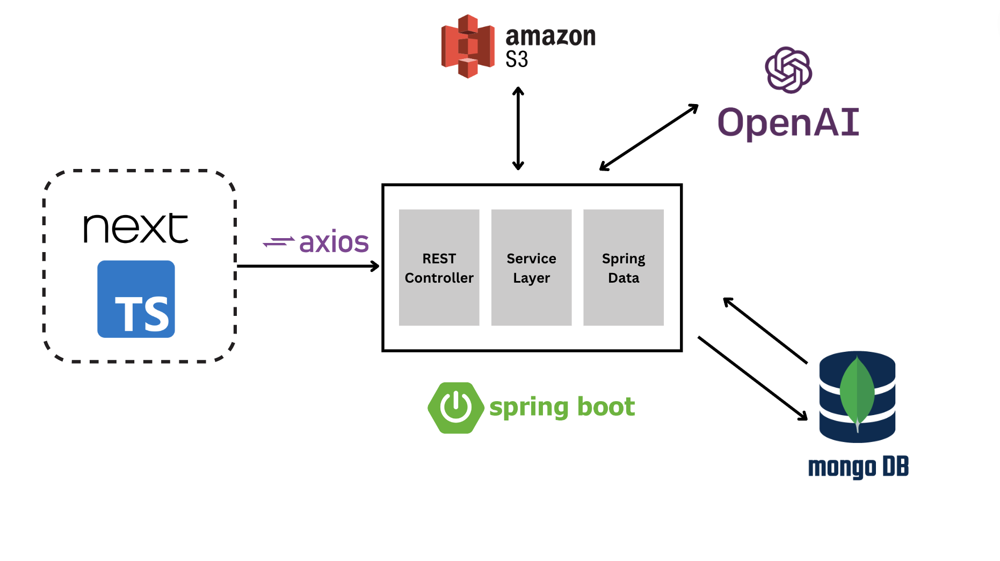
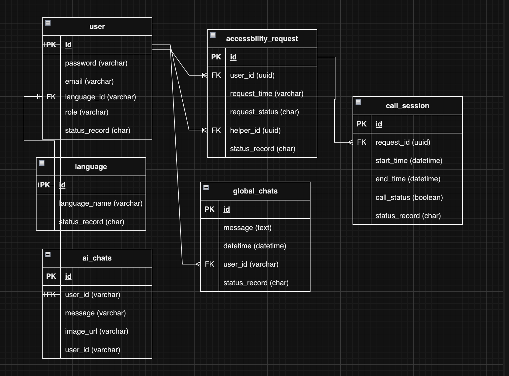
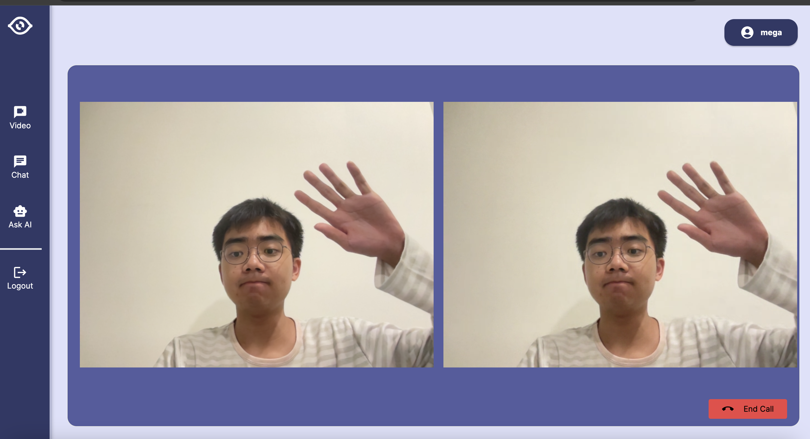
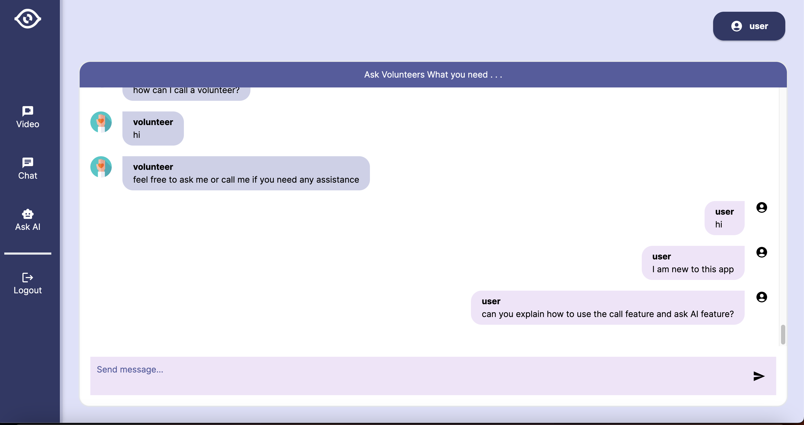
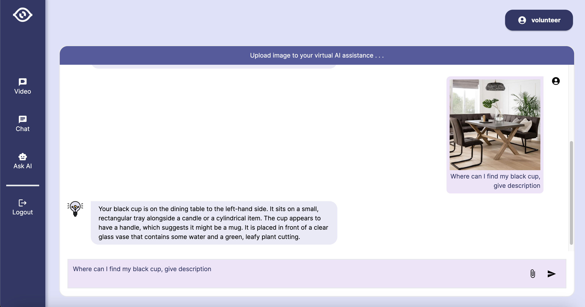

# ShareMySight-Backend

Welcome to ShareMySight - Connecting the Visually Impaired with Compassionate Volunteers!

## Table of Contents

- [Introduction](#introduction)
- [Main Features](#main-features)
- [Technologies Used](#technologies-used)
- [Installation](#installation)

## Introduction

ShareMySight is a revolutionary application designed to bridge the gap between visually impaired individuals and volunteers who are eager to assist. The app leverages voice calls, chat assistance, and a generative AI to enhance the visual experience for those with impaired vision.

## Main Features

1. **Connect with Volunteers:**
    - Easily connect with volunteers through voice calls for real-time assistance.


2. **Chat Assistant:**
    - Engage in text-based conversations with volunteers who can provide support, answer questions, and offer guidance.


3. **Generative AI Image Descriptions:**
    - Utilize our advanced generative AI to receive detailed descriptions of images, enhancing the understanding of visual content.

## Technologies Used

- **Voice Calls:** WebRTC
- **Chat Assistance:** WebSocket
- **Generative AI:** Open AI Vision API
- **User Interface:** NextTS, TailwindCSS
- **Backend:** Node.js, Springboot
- **Database:** MongoDB
- **Authentication:** JSON Web Tokens (JWT)
- **Image Upload:** AWS S3

## Application Architecture



## Database Schema



## Demo Overview





## Installation Steps
### 1.Clone Repository
```bash
git clone https://github.com/Calon-QA-engineer/ShareMySight-Backend
cd ShareMySight-Backend
```
### 2. Get API Key & AWS Access Key
```bash
Visit [OpenAI](https://platform.openai.com/api-keys) to obtain your API key.
Visit [AWS](https://ap-southeast-1.console.aws.amazon.com) and generate your own AWS S3 access key.
```
### 3. Setup environment variables
```bash
OPENAI_API_KEY=your_openai_api_key_here
AWS_ACCESS_KEY_ID=your_aws_access_key_id_here
AWS_SECRET_ACCESS_KEY=your_aws_secret_access_key_here
PORT=8080
```
### 4. Build your project using Maven
```bash
./mvnw clean install
```
### 5. Docker Compose
```bash
docker compose up -d
```

